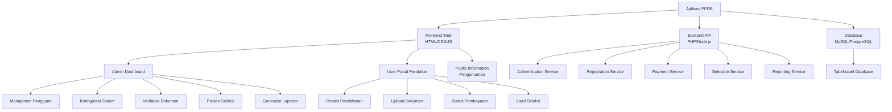

# Aplikasi Penerimaan Siswa Baru (PPDB)

## Gambaran Umum
Aplikasi Penerimaan Siswa Baru (PPDB) adalah sistem terkomputerisasi yang dirancang untuk mengelola proses penerimaan siswa baru di institusi pendidikan. Sistem ini menyederhanakan proses pendaftaran, seleksi, dan pengumuman hasil bagi calon siswa serta memberikan alat manajemen yang komprehensif bagi administrator.

## Diagram Arsitektur Sistem

## Struktur Database Lengkap

### Tabel Users
| Field | Type | Constraints | Description |
|-------|------|-------------|-------------|
| id | INT | PRIMARY KEY, AUTO_INCREMENT | ID unik pengguna |
| role | ENUM('admin','pendaftar') | NOT NULL | Role pengguna |
| email | VARCHAR(100) | UNIQUE, NOT NULL | Email untuk login |
| password | VARCHAR(255) | NOT NULL | Password terenkripsi |
| name | VARCHAR(100) | NOT NULL | Nama lengkap |
| is_active | BOOLEAN | DEFAULT TRUE | Status akun aktif/non-aktif |
| last_login | TIMESTAMP | NULLABLE | Waktu login terakhir |
| created_at | TIMESTAMP | DEFAULT CURRENT_TIMESTAMP | Waktu dibuat |

### Tabel Students (Pendaftar)
| Field | Type | Constraints | Description |
|-------|------|-------------|-------------|
| id | INT | PRIMARY KEY, AUTO_INCREMENT | ID unik siswa |
| user_id | INT | FOREIGN KEY (users.id) | Relasi ke tabel users |
| nisn | VARCHAR(20) | UNIQUE, NOT NULL | Nomor Induk Siswa Nasional |
| nik | VARCHAR(16) | UNIQUE, NOT NULL | NIK siswa |
| full_name | VARCHAR(100) | NOT NULL | Nama lengkap siswa |
| gender | ENUM('L','P') | NOT NULL | Jenis kelamin |
| birth_place | VARCHAR(50) | NOT NULL | Tempat lahir |
| birth_date | DATE | NOT NULL | Tanggal lahir |
| religion | VARCHAR(20) | NOT NULL | Agama |
| address | TEXT | NOT NULL | Alamat lengkap |
| phone | VARCHAR(15) | NOT NULL | Nomor telepon |
| school_origin | VARCHAR(100) | NOT NULL | Asal sekolah |
| father_name | VARCHAR(100) | NOT NULL | Nama ayah |
| mother_name | VARCHAR(100) | NOT NULL | Nama ibu |
| parent_phone | VARCHAR(15) | NOT NULL | Nomor telepon orang tua |

### Tabel Registration
| Field | Type | Constraints | Description |
|-------|------|-------------|-------------|
| id | INT | PRIMARY KEY, AUTO_INCREMENT | ID unik pendaftaran |
| student_id | INT | FOREIGN KEY (students.id) | Relasi ke tabel students |
| registration_number | VARCHAR(20) | UNIQUE, NOT NULL | Nomor pendaftaran unik |
| academic_year | VARCHAR(9) | NOT NULL | Tahun ajaran (2023/2024) |
| major | VARCHAR(50) | NOT NULL | Jurusan yang dipilih |
| registration_date | DATE | DEFAULT CURRENT_DATE | Tanggal pendaftaran |
| status | ENUM('baru','verifikasi','lolos','tidak_lolos') | DEFAULT 'baru' | Status pendaftaran |
| selection_score | DECIMAL(5,2) | NULLABLE | Nilai seleksi |
| notes | TEXT | NULLABLE | Catatan dari admin |

### Tabel Documents
| Field | Type | Constraints | Description |
|-------|------|-------------|-------------|
| id | INT | PRIMARY KEY, AUTO_INCREMENT | ID unik dokumen |
| registration_id | INT | FOREIGN KEY (registration.id) | Relasi ke tabel registration |
| document_type | VARCHAR(50) | NOT NULL | Jenis dokumen (ijazah, kk, dll) |
| file_name | VARCHAR(255) | NOT NULL | Nama file asli |
| file_path | VARCHAR(255) | NOT NULL | Path penyimpanan file |
| verified | BOOLEAN | DEFAULT FALSE | Status verifikasi |
| verified_by | INT | FOREIGN KEY (users.id), NULLABLE | Admin yang memverifikasi |
| verified_at | TIMESTAMP | NULLABLE | Waktu verifikasi |

### Tabel Payments
| Field | Type | Constraints | Description |
|-------|------|-------------|-------------|
| id | INT | PRIMARY KEY, AUTO_INCREMENT | ID unik pembayaran |
| registration_id | INT | FOREIGN KEY (registration.id) | Relasi ke tabel registration |
| amount | DECIMAL(10,2) | NOT NULL | Jumlah pembayaran |
| payment_date | DATE | NULLABLE | Tanggal pembayaran |
| due_date | DATE | NOT NULL | Tanggal jatuh tempo |
| payment_method | VARCHAR(50) | NULLABLE | Metode pembayaran |
| proof_path | VARCHAR(255) | NULLABLE | Bukti pembayaran |
| status | ENUM('pending','paid','failed','expired') | DEFAULT 'pending' | Status pembayaran |
| verified_by | INT | FOREIGN KEY (users.id), NULLABLE | Admin yang memverifikasi |

### Tabel System Settings
| Field | Type | Constraints | Description |
|-------|------|-------------|-------------|
| id | INT | PRIMARY KEY, AUTO_INCREMENT | ID unik pengaturan |
| setting_key | VARCHAR(50) | UNIQUE, NOT NULL | Kunci pengaturan |
| setting_value | TEXT | NOT NULL | Nilai pengaturan |
| description | VARCHAR(255) | NULLABLE | Deskripsi pengaturan |

## Fitur Administrator Lengkap

### 1. Dashboard Admin
- Statistik pendaftaran real-time (total, verified, pending, dll)
- Grafik jumlah pendaftar per hari dan per jurusan
- Notifikasi tugas yang perlu perhatian (verifikasi dokumen, dll)
- Kalender timeline PPDB

### 2. Manajemen Pendaftar
- Daftar semua pendaftar dengan filter lengkap
- Pencarian berdasarkan nama, NISN, atau nomor pendaftaran
- Detail lengkap profil pendaftar
- Verifikasi dokumen dengan penanda status
- Input nilai seleksi dan kriteria
- Ubah status pendaftaran (baru, verifikasi, lolos, tidak lolos)
- Ekspor data pendaftar ke Excel/PDF

### 3. Manajemen Pembayaran
- Daftar status pembayaran semua pendaftar
- Verifikasi bukti pembayaran
- Update status pembayaran
- Generate kode pembayaran virtual

### 4. Pengaturan Sistem
- Kelola tahun ajaran dan periode pendaftaran
- Konfigurasi kuota per jurusan
- Kelola biaya pendaftaran
- Konfigurasi kriteria seleksi dan bobot nilai
- Kelola tahapan dan timeline PPDB
- Template email notifikasi
- Backup dan restore database

### 5. Laporan dan Analitik
- Laporan statistik pendaftaran
- Laporan keuangan dan pembayaran
- Analisis data pendaftar (asal sekolah, daerah, dll)
- Ekspor laporan dalam berbagai format
- Dashboard visual dengan grafik dan chart

### 6. Manajemen Pengguna
- Kelola akun admin dan staff
- Assign role dan permissions
- Audit log aktivitas sistem

## Fitur User/Pendaftar Lengkap

### 1. Dashboard User
- Status pendaftaran terkini
- Progress indicator kelengkapan data
- Notifikasi dan pengumuman penting
- Checklist tugas yang perlu diselesaikan

### 2. Profil dan Pendaftaran
- Formulir data pribadi dengan validasi
- Formulir data orang tua dan wali
- Formulir data akademik dan prestasi
- Preview dan edit data sebelum submit
- Generate nomor pendaftaran otomatis

### 3. Upload Dokumen
- Daftar dokumen yang diperlukan
- Upload multiple files dengan drag & drop
- Preview dokumen yang telah diupload
- Status verifikasi dokumen
- Notifikasi jika dokumen ditolak

### 4. Pembayaran
- Informasi biaya pendaftaran
- Instruksi pembayaran lengkap
- Upload bukti pembayaran
- Status verifikasi pembayaran
- Download invoice pembayaran

### 5. Hasil Seleksi
- Countdown waktu pengumuman
- View hasil seleksi (lolos/tidak lolos)
- Download surat keterangan diterima
- Informasi langkah selanjutnya bagi yang diterima

### 6. Bantuan dan Support
- FAQ umum seputar PPDB
- Formulir kontak dan bantuan
- Informasi kontak panitia PPDB

## Teknologi yang Disarankan

### Frontend:
- HTML5, CSS3, JavaScript ES6+
- Bootstrap 5/Tailwind CSS untuk UI
- Chart.js untuk visualisasi data
- Dropzone.js untuk upload file
- DataTables untuk tabel interaktif

### Backend:
- PHP 8+ dengan framework Laravel/CodeIgniter
- atau Node.js dengan Express.js
- RESTful API architecture
- Library untuk generate PDF (Dompdf, etc)
- Library untuk export Excel (PhpSpreadsheet, etc)

### Database:
- MySQL 8+ atau PostgreSQL
- Redis untuk caching (opsional)

### Keamanan:
- HTTPS dengan SSL certificate
- Enkripsi password dengan bcrypt
- Protection against SQL injection, XSS, CSRF
- Rate limiting untuk API endpoints
- Validasi input data di frontend dan backend
- Regular backup database

### Server:
- Apache/Nginx web server
- PHP 8+ atau Node.js environment
- Cloud storage untuk file upload (opsional)

## Alur Proses PPDB

1. **Pendaftaran Akun** → Calon siswa membuat akun dengan email dan password
2. **Pengisian Data** → Mengisi formulir data pribadi, orang tua, dan akademik
3. **Upload Dokumen** → Mengupload dokumen yang dipersyaratkan
4. **Pembayaran** → Melakukan pembayaran dan upload bukti
5. **Verifikasi Admin** → Admin memverifikasi data, dokumen, dan pembayaran
6. **Proses Seleksi** → Sistem melakukan seleksi berdasarkan kriteria
7. **Pengumuman** → Hasil seleksi diumumkan melalui dashboard user
8. **Daftar Ulang** → Proses lanjutan bagi yang diterima (jika diperlukan)

## Modul Tambahan (Opsional)

1. **Modul SMS Gateway** → Notifikasi via SMS
2. **Modul Whatsapp Integration** → Notifikasi via Whatsapp
3. **Modul Panggilan Online** → Video call untuk wawancara
4. **Modul Testing Online** → Tes seleksi online terintegrasi
5. **Modul Zoom Integration** → Virtual orientation

Aplikasi ini dapat dikustomisasi sesuai kebutuhan spesifik institusi pendidikan dan dapat diintegrasikan dengan sistem akademik yang sudah ada.
